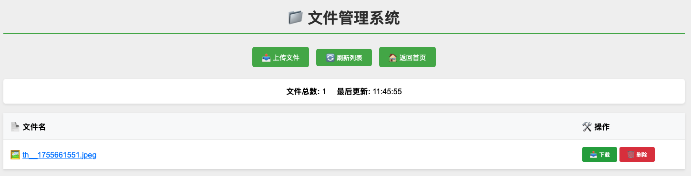
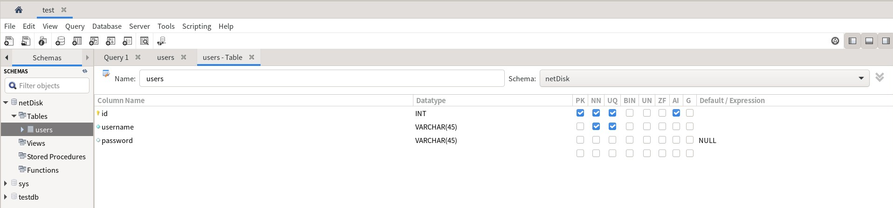

# 🌐 MyPoorWebServerInCpp

> 一个轻量级、高性能的 C++ HTTP Web 服务器，专为学习和实践而设计

## 写在开头

这是本人这段时间从零开始学习的一个 C++ HTTP Web 服务器项目，旨在学习C++、计算机网络、操作系统、数据库和后端开发的基本原理，由于对于web开发和C++的了解还很浅薄，所以这个项目的代码可能会有很多不规范和不优雅的地方，在此希望各位大佬多多指教和批评指正。

同时特别鸣谢这位大佬[@阿秀](https://github.com/forthespada)，本人就是在阅读完这个仓库[MyPoorWebServer](https://github.com/forthespada/MyPoorWebServer)的文档和代码后，才对 C++ Web 服务器的实现有了更深入的理解，十分感谢大佬的开源付出。

也要特别感谢Copilot的帮助，它在我编写代码和文档时提供了很多有用的建议和提示，除了在后端webserver开发过程中教会我相关知识，由于本人不会前端的技术，同时想要快速实现前端功能，所以**本项目的所有的前端代码都是由Copilot自动生成的**，虽然有些代码可能不太符合规范，但他节约了我前端开发的时间和精力，让我可以更专注于后端逻辑的实现，十分感谢Copilot的帮助。

同时，也感谢ChatGPT和DeepSeek等大模型，在开发过程中教会了我很多技术细节和实现思路，帮助我更好地理解和应用 C++ 的各种特性，也感谢我在互联网上找到的各种相关资料或者博客，内容过多无法一一列举，感谢他们为我的学习和开发提供了很大的帮助。[这是本人写的开发笔记，不过内容不完善](https://wwwtwilight.github.io/posts/cppwebserverdeveloplog/cppwebserverdeveloplog/)

最后，感谢你阅读这个项目的文档，希望你能从中学到一些有用的知识，也欢迎你参与到这个项目中来，一起完善和优化它！

## 项目简介

这是一个类似网盘的项目，实现了基础的登陆注册，文件上传、预览、下载和删除等功能，支持多用户分目录存储




功能相对简单，但是包含了多种技术的综合应用，适合用来学习和实践 C++ Web 开发的基本原理。

## ✨ 核心特性

- 🚀 **多线程编程** - 每一个用户访问网站都将被分配到一个独立的线程进行处理，实现多个用户同时访问
- 🔐 **登陆认证系统** - 使用Cookie实现持久化登陆，登陆后五分钟内可以对文件管理
- 📁 **分用户文件管理** - 独立用户空间的文件上传、预览、下载
- 🎨 **现代化界面** - 响应式设计，支持拖拽上传
- 🛡️ **安全防护** - 路径遍历防护、文件名过滤、权限验证
- 📊 **实时反馈** - 文件操作进度显示与状态提示
- 💾 **MySQL管理用户** - 使用MySQL数据库存储用户信息

## 📁 项目架构

```
MyPoorWebServerInCpp/
├── 📄 main.cpp                    # 🚀 主程序入口 & 服务器启动
├── 📄 Makefile                    # 🔧 构建配置文件
├── 📄 list_sources.sh             # 📜 源码统计脚本
├── 📂 include/                    # 📚 头文件目录
│   ├── webserverSet.h             #   ⚙️  服务器配置管理
│   ├── requestHandler.h           #   🔄 HTTP 请求处理器
│   ├── route.h                    #   🛤️  路由系统定义
│   ├── httpMes.h                  #   📨 HTTP 消息解析与存储
│   ├── cookie.h                   #   🍪 Cookie 会话管理
│   ├── utils.h                    #   🛠️  通用工具函数
│   ├── error.h                    #   ❌ 错误处理定义
│   └── sql.h                      #   🗄️  数据库接口
├── 📂 src/                        # 💻 源代码实现
│   ├── webserverSet.cpp           #   ⚙️  服务器核心配置
│   ├── requestHandler.cpp         #   🔄 请求分发处理
│   ├── route.cpp                  #   🛤️  路由逻辑实现
│   ├── httpMes.cpp                #   📨 HTTP 协议解析与存储实现
│   ├── cookie.cpp                 #   🍪 Cookie 管理
│   ├── utils.cpp                  #   🛠️  工具函数实现
│   ├── error.cpp                  #   ❌ 错误响应处理
│   └── sql.cpp                    #   🗄️  用户数据管理
├── 📂 httpdocs/                   # 🌐 Web 静态资源
│   ├── index.html                 #   🏠 项目主页
│   ├── post.html                  #   🔐 用户登录页面
│   ├── register.html              #   📝 用户注册页面
│   ├── upload.html                #   📤 文件上传界面
│   ├── files.html                 #   📂 文件管理中心
│   ├── about.html                 #   ℹ️  项目介绍页面
│   └── contact.html               #   📞 联系信息页面
└── 📂 upload/                     # 💾 用户文件存储（本文件夹项目中没有，但是用户上传文件时会自动生成）
    ├── admin/                     #   👤 测试用户目录1
    ├── test/                      #   👤 测试用户目录2
    └── [username]/                #   👥 动态用户目录
```

## 🔧 核心功能模块

### 🛤️ 智能路由系统
- **静态路由**: HTML/CSS/JS 等静态资源服务
- **动态路由**: API 接口与数据交互
- **权限路由**: 基于 Cookie 的访问控制
- **文件路由**: 分用户目录的文件访问

### 👤 用户认证与管理  
```cpp
// 默认测试账户，这里根据你的数据库中的内容进行调整
用户名: admin    密码: 123456
用户名: test     密码: 123456
```
- 🔐 安全的密码验证机制
- 🍪 基于 Cookie 的会话管理
- ⏰ 自动过期与权限验证
- 🚪 统一的登录/注册入口

### 📁 分用户文件系统
- **独立空间**: 每个用户拥有独立的文件目录
- **安全隔离**: 用户间文件完全隔离，无法跨用户访问
- **实时管理**: 上传、预览、下载、删除一体化
- **格式支持**: 图片、文档、视频、压缩包等多格式

### 📡 API 接口

| 路由 | 方法 | 功能描述 | 参数 | 权限 |
|------|------|----------|------|------|
| `/api/register` | POST | 用户注册 | `username`, `password` | 公开 |
| `/api/post` | POST | 用户登录 | `username`, `password` | 公开 |
| `/api/files` | GET | 获取用户文件列表 | 无 | 需登录 |
| `/api/upload` | POST | 文件上传 | `multipart/form-data` | 需登录 |
| `/api/download` | GET | 强制下载文件 | `file=文件名` | 需登录 |
| `/api/delete` | GET | 删除用户文件 | `file=文件名` | 需登录 |
| `/upload/[user]/[file]` | GET | 预览/打开文件 | 路径参数 | 需登录 |

## 🚀 快速开始

### 📋 环境要求
- **操作系统**: Linux（本文以Ubuntu为准） / macOS（不推荐，本人使用macOS没有配置成功，如需在mac上运行请自行搜索相关资料）
- **编译器**: GCC 7.0+ (需支持 C++20)
- **依赖**: 标准 C++ 库 MySQL/connect（配置详情见后文运行部分）
- **内存**: 最低 256MB RAM
- **存储**: 至少 50MB 可用空间

### 🛠️ 配置内容

#### MySQL Connector/C++ 配置

需要你手动配置，主要是MySQL部分，我们需要使用MySQL提供的 C++ 连接器来操作数据库，我们需要先下载相关的内容，然后在`Makefile`文件中进行连接编译。

首先需要确定你的电脑是否有MySQL，如果没有请先安装MySQL，这个自己解决，本文默认你已经安装好了MySQL，并且可以正常使用。

如果你不确定，可以在终端输入以下命令来检查是否安装了MySQL：
```bash
mysql --version
```
有看到版本号说明已经安装好了MySQL，可以正式开始配置。

首先需要确定是否有安装安装 MySQL Connector/C++，可以在终端输入以下命令来检查：
```bash
dpkg -l | grep libmysqlcppconn-dev
```

如果没有安装，请访问[MySQL Connector/C++](https://dev.mysql.com/downloads/connector/cpp/)，并选择下载符合您操作系统的安装程序并完成安装，解压之后应该会有一个类似 `mysql-connector-c++-8.0.33-linux-glibc2.17-x86_64` 的目录，我建议你将其中的 `include/jdbc` 和 `lib（lib64）` 目录中的内容添加到你的系统路径`/usr/include` 和 `/usr/lib`中，这样子IDE的解释器可以找到相关的头文件和库文件了，不然IDE会显示错误。

这之后就是一个比较麻烦的点了，需要确定安装之后的 MySQL Connector/C++ 头文件和库函数的路径。我们先来找头文件，我们需要找到这几个头文件，

```cpp
#include <mysql_driver.h>
#include <mysql_connection.h>
#include <cppconn/statement.h>
#include <cppconn/resultset.h>
#include <cppconn/prepared_statement.h>
```

本人而言，头文件在 `/usr/include` 和 `/usr/include/cppconn` 目录下，这里请你记住这两个路径，然后在 `Makefile` 中的第二行`-I`后面添加这两个路径，如下
```makefile
CXXFLAGS = -Wall -Wextra -std=c++20 -I/usr/include -I/usr/include/cppconn -L/usr/lib/x86_64-linux-gnu -lmysqlcppconn
```

随后我们需要找到 MySQL Connector/C++ 的库文件路径，本人的路径在 `/usr/lib/x86_64-linux-gnu`下的`libmysqlcppconn.so`，如果没找到，可以在终端输入以下命令来查找：
```bash
find /usr/lib -name "libmysqlcppconn.so"
# 这里的后缀名.so是Linux下的动态链接库文件后缀名，如果你是macOS系统，可能是.dylib
```

随后也像上面一样，在 `Makefile` 中的第二行`-L`后面添加这个路径并且在`-l`后面添加mysqlcppconn，如下所示：
```makefile
CXXFLAGS = -Wall -Wextra -std=c++20 -I/usr/include -I/usr/include/cppconn -L/usr/lib/x86_64-linux-gnu -lmysqlcppconn
```

如果你的库函数和头文件恰好和我的一致，那就皆大欢喜，你不用更改`Makefile` 中的内容，直接进入下一步。

#### MySQL 数据库配置

本项目使用到了 MySQL 数据库来存储用户信息和文件元数据，需要先创建一个数据库和用户表。

如果你使用的是 MySQL Workbench，可以按照我这样配置



如果你使用的是命令行，可以执行以下 SQL 语句来创建数据库和表（本文默认你已经登陆了对应的账户）：

```sql
CREATE SCHEMA `netDisk` ;

CREATE TABLE `netDisk`.`users` (
  `id` INT NOT NULL AUTO_INCREMENT,
  `username` VARCHAR(45) NOT NULL,
  `password` VARCHAR(45) NULL,
  PRIMARY KEY (`id`),
  UNIQUE INDEX `id_UNIQUE` (`id` ASC) VISIBLE,
  UNIQUE INDEX `username_UNIQUE` (`username` ASC) VISIBLE);

INSERT INTO `netDisk`.`users` (`id`, `username`, `password`) VALUES ('1', 'admin', '123456');
INSERT INTO `netDisk`.`users` (`id`, `username`, `password`) VALUES ('2', 'test', '123456');

```

最后在 `src/sql.cpp` 中的 `sqlInit()` 函数中修改数据库连接信息，确保用户名和密码与你创建的数据库用户一致：

```cpp
const string host = "tcp://127.0.0.1:3306"; // 这是默认端口，有需要可以改，一般不用改
const string user = "root"; // 这里的用户名需要和你创建的数据库用户一致
const string password = "Password123#@!";  // 密码要改成你的用户对应的密码
const string database = "netDisk"; // 数据库名要匹配，和刚刚创建的名称要一致
```

### ⚡ 运行
```bash
# 1. 克隆项目
git clone https://github.com/wwwTwilight/myCppWebServer.git
cd MyPoorWebServerInCpp

# 2. 编译项目
make

# 3. 启动服务器
./httpd
# 或者使用 make 命令
make run

# 🎉 打开浏览器访问: http://localhost:8080 或 http://127.0.0.1:8080
```

### 🔧 编译选项
```bash
make           # 标准编译
make rebuild   # 重新编译
make clean     # 清理编译文件
make info      # 查看项目信息
make run       # 运行
```

## 📖 使用指南

### 🏠 1. 访问主页
```bash
http://localhost:8080           # 主页
http://localhost:8080/index.html
```

### 👤 2. 用户系统
```bash
# 注册新用户
http://localhost:8080/register.html
- 输入用户名和密码
- 系统自动创建用户目录

# 用户登录  
http://localhost:8080/post.html
- 默认账户: admin / 123456
- 登录成功后能够进行文件管理
```

### 📤 3. 文件上传
```bash
http://localhost:8080/upload.html
```
- 🖱️ **拖拽上传**: 直接拖拽文件到上传区域
- 📁 **点击选择**: 点击上传区域选择文件
- 📊 **实时进度**: 上传进度条显示
- ✅ **格式检查**: 自动验证文件类型和大小

### 📂 4. 文件管理
```bash
http://localhost:8080/files.html  # 需要登录
```
- 👁️ **文件预览**: 点击文件名在浏览器中打开
- ⬇️ **文件下载**: 点击下载按钮保存到本地
- 🗑️ **文件删除**: 一键删除不需要的文件
- 🔄 **实时刷新**: 自动更新文件列表

## 🔬 技术实现

### 🏗️ 系统架构
```cpp
┌─────────────────┐    ┌─────────────────┐    ┌─────────────────┐
│   HTTP Client   │───▶│  Web Server     │───▶│  File System    │
│   (Browser)     │    │  (C++ Backend)  │    │  (User Dirs)    │
└─────────────────┘    └─────────────────┘    └─────────────────┘
         │                       │                       │
         │              ┌─────────────────┐              │
         └──────────────▶│  Static Files   │◀─────────────┘
                         │  (HTML/CSS/JS)  │
                         └─────────────────┘
```

### 🧵 多线程并发模型
```cpp
// 主服务器循环 - 接受连接
while (true) {
    int client_socket = accept(server_socket, ...);
    // 为每个客户端创建独立线程
    std::thread client_thread(handle_request, client_socket);
    client_thread.detach();  // 分离线程，自动清理
}
```

### 📨 HTTP 协议处理
- **请求解析**: 完整的 HTTP/1.1 请求头解析
- **响应构建**: 标准 HTTP 响应格式
- **内容协商**: 自动 MIME 类型识别
- **传输编码**: Content-Length 精确控制

### 🔒 安全机制
```cpp
// 路径遍历防护
string safe_path = validate_path(user_input);
if (safe_path.find("../") != string::npos) {
    return FORBIDDEN;
}

// 文件名安全过滤
string secure_filename(const string& filename) {
    string result = filename;
    // 移除危险字符: \ / : * ? " < > |
    // 防止路径注入攻击
    return result;
}
```

## ⚙️ 配置说明

### 🌐 服务器配置
```cpp
// main.cpp 中可修改的配置
unsigned short port = 8080; // 服务器端口，可以修改为其他端口
```

### 📋 支持的文件类型
| 类别 | 扩展名 | MIME 类型 | 浏览器行为 |
|------|--------|-----------|------------|
| 🌐 **网页** | `.html`, `.htm` | `text/html` | 直接显示 |
| 🎨 **样式** | `.css` | `text/css` | 应用样式 |
| ⚡ **脚本** | `.js` | `application/javascript` | 执行代码 |
| 🖼️ **图片** | `.jpg`, `.png`, `.gif` | `image/*` | 图片预览 |
| 📄 **文档** | `.pdf`, `.txt` | `application/pdf`, `text/plain` | 在线阅读 |
| 🎵 **音频** | `.mp3`, `.wav` | `audio/*` | 音频播放 |
| 🎬 **视频** | `.mp4`, `.avi` | `video/*` | 视频播放 |
| 📦 **压缩** | `.zip`, `.rar` | `application/octet-stream` | 强制下载 |

## 🛠️ 开发扩展

### 🛤️ 添加新路由
```cpp
// 在 src/route.cpp 的 routeInit() 函数中添加
void routeInit() {
    // GET 路由
    get_routes["/yourRoute"] = yourFunction;

    // POST 路由
    post_routes["/yourRoute"] = yourFunction;

}

// 实现处理函数
int yourFunction(HttpMessage& http_message) {
    // 处理请求
    return 1;
}
```

### 🎨 自定义错误页面
```cpp
// 修改 src/error.cpp
void not_found(int client_socket) {
    string custom_404 = 
        "HTTP/1.1 404 Not Found\r\n"
        "Content-Type: text/html; charset=utf-8\r\n\r\n"
        "<html><body><h1>🔍 页面未找到</h1></body></html>";
    send(client_socket, custom_404.c_str(), custom_404.length(), 0);
}
```

### 📊 添加新的 MIME 类型
```cpp
// 在 src/utils.cpp 的 get_mime_type() 函数中添加
string get_mime_type(const string& path) {
    string ext = get_file_extension(path);
    
    if (ext == ".json") return "application/json";
    if (ext == ".xml")  return "application/xml";
    if (ext == ".svg")  return "image/svg+xml";
    // ... 添加更多类型
    
    return "application/octet-stream";  // 默认类型
}
```

## 🚧 开发路线图

### 🎯 Abydos
主要实现了将[MyPoorWebServer](https://github.com/forthespada/MyPoorWebServer)的代码从C使用C++进行重构，使用了更加先进的C++特性和标准库，提升了代码的可读性和可维护性。目前可见于master分支，已停止维护与更新。

### 🔮 Millennium (见Aug 7, 2025的“readme更新”提交)
- 实现了一个简单的用户认证系统，支持登录
- 支持单个用户的验证以及存储文件，用户可以上传、预览、下载和删除服务器文件
- 实现了一个简单的前端界面，支持文件上传、预览和下载等功能
- 支持多线程并发处理，能够同时处理多个用户的请求
- 实现了一个简单的路由系统，支持静态文件和动态请求的处理
- 支持基本的错误处理

### 🌟 Trinity (当前版本)
- 使用MySQL数据库存储用户信息
- 实现了用户注册和登录功能，完善了Cookie持久化登录
- 实现了分用户目录的文件管理，用户可以在自己的目录下进行文件操作
- 完善了前端界面，支持拖拽上传、文件预览

## 🤝 贡献指南

### 📝 提交代码
- 请确保代码符合 C++20 标准
- 使用清晰的提交信息描述变更内容
- 提交前运行 `make` 确保编译通过
- 欢迎提交 Pull Request

### 🐛 报告问题
- 使用 GitHub Issues 报告 Bug
- 提供详细的复现步骤
- 包含系统环境信息

### 💡 功能建议
- 在 Issues 中描述新功能需求
- 说明使用场景和预期效果
- 欢迎提供设计方案

## 👨‍💻 作者信息

**wwwTwilight**
- 🐙 GitHub: [@wwwTwilight](https://github.com/wwwTwilight)  
- 📧 Email: hyman0611wu@gmail.com
- 🌐 项目: [myCppWebServer](https://github.com/wwwTwilight/myCppWebServer)

### 开发分工
- **wwwTwilight**: 主要开发者，负责后端核心功能实现以及项目功能规划
- **Copilot Pro**: 负责前端代码生成和逻辑实现

欢迎参与贡献

## ⭐ 致谢

感谢所有为这个项目做出贡献的开发者！如果这个项目对你有帮助，请给个 ⭐ Star 支持一下！

---

<div align="center">

**🌟 MyPoorWebServerInCpp 🌟**

</div>
